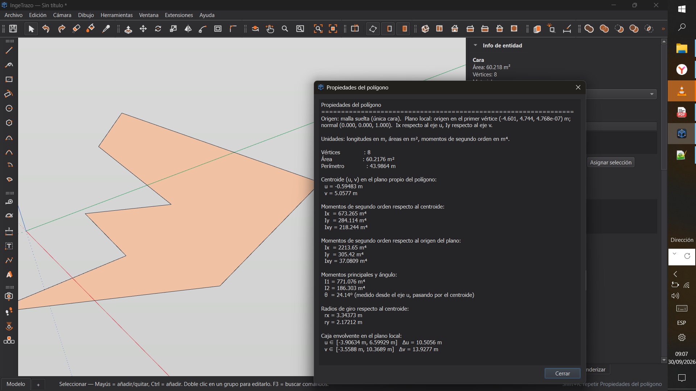

# Propiedades del polígono — plugin para IngeTrazo

Plugin para [IngeTrazo](https://github.com/ingelibre/ingetrazo) que calcula
las propiedades geométricas del polígono (cara) seleccionado en el modelo:

- Área y perímetro
- Centroide en el plano propio del polígono
- Momentos de segundo orden `Ix`, `Iy`, `Ixy` respecto al centroide y al origen
- Momentos principales `I1`, `I2` y el ángulo `θ` de los ejes principales
- Radios de giro `rx`, `ry`
- Caja envolvente en el plano local

Funciona con polígonos convexos y no convexos (la fórmula del lazo y el
método de Newell no requieren convexidad, solo que el contorno sea simple).

## Instalación

1. Descarga [`propiedades_poligono.py`](propiedades_poligono.py).
2. Copia el archivo en tu carpeta de plugins de IngeTrazo:

   - **Linux:** `~/.local/share/ingetrazo/plugins/`
     (o `$XDG_DATA_HOME/ingetrazo/plugins/` si lo tienes definido)
   - **Windows:** `%APPDATA%\Roaming\ingetrazo\plugins`

   La propia aplicación te abre esa carpeta desde
   **Extensions ▸ Abrir carpeta de plugins**.
3. Reinicia IngeTrazo.
4. Aparecerá una entrada **Extensions ▸ Propiedades del polígono**.

## Uso

1. Dibuja un polígono (una cara) y selecciónalo con la herramienta de
   selección.
2. **Extensions ▸ Propiedades del polígono**.
3. Aparece un diálogo con el informe completo; la barra de estado muestra
   un resumen con el área y el perímetro.

## Unidades

IngeTrazo trabaja internamente en **metros**. El informe usa el sistema
derivado de esa unidad base:

| Magnitud                          | Unidad |
|-----------------------------------|--------|
| Longitudes (perímetro, lados…)    | m      |
| Área                              | m²     |
| Momentos de segundo orden         | m⁴     |
| Radios de giro                    | m      |
| Ángulo `θ`                        | °      |

Para cambiar a centímetros o milímetros, edita el bloque `UNIT_LENGTH` /
`UNIT_AREA` / `UNIT_MOMENT` al inicio del archivo; la matemática no cambia.

## Sobre los ejes locales

El plugin proyecta los vértices a un plano 2D propio del polígono. El eje
`u` se elige de forma que sea perpendicular a la normal del polígono y lo
más alineado posible con los ejes del mundo; el eje `v` cierra la base
ortonormal. El **origen** de ese plano local es el **primer vértice** del
polígono, no el origen del mundo, para que los resultados queden referidos
a un punto del propio objeto.

Si necesitas las propiedades respecto al origen global, dímelo y añado una
opción al diálogo.

## Compatibilidad

- Probado con **IngeTrazo 0.5.6.1** (última prueba: septiembre de 2026).
- La API de plugins de IngeTrazo **no es estable todavía** durante la serie
  0.5.6.1: pueden aparecer cambios incompatibles en cualquier actualización.
  Si tras actualizar IngeTrazo el plugin deja de funcionar, abre una
  [issue](https://github.com/TU_USUARIO/ingetrazo-propiedades-poligono/issues)
  con el mensaje de la barra de estado y la versión de IngeTrazo.

## Limitaciones conocidas

- Trabaja sobre **una sola cara** por ejecución. Si tienes varias
  seleccionadas, usa solo la primera; si la malla suelta tiene varias
  caras y nada está seleccionado, el plugin avisa y no calcula.
- La malla debe ser **plana**: el plugin asume un polígono contenido en un
  plano. Un polígono no plano dará resultados sin sentido geométrico.
- No modifica el documento: es un plugin **de solo lectura**. Puedes
  ejecutarlo tantas veces como quieras, no ensucia el historial de undo.

## Licencia

MIT. Ver [LICENSE](LICENSE).

## Créditos

Escrito por RonyLeonel6 con ayuda de un asistente de IA Deepseek. Inspirado en la
idea de ya ver mas plugins en el programa. 

